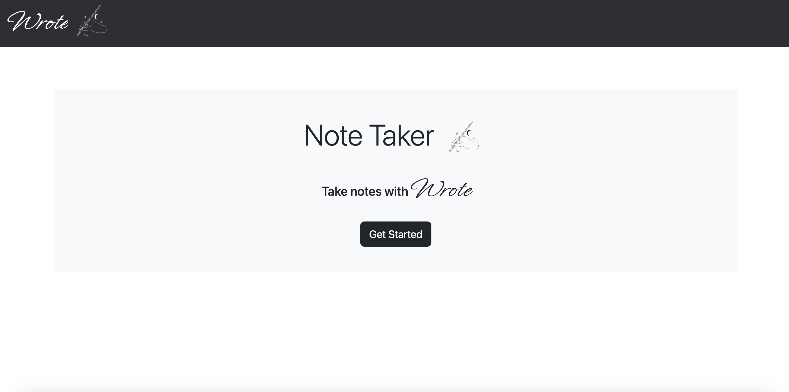
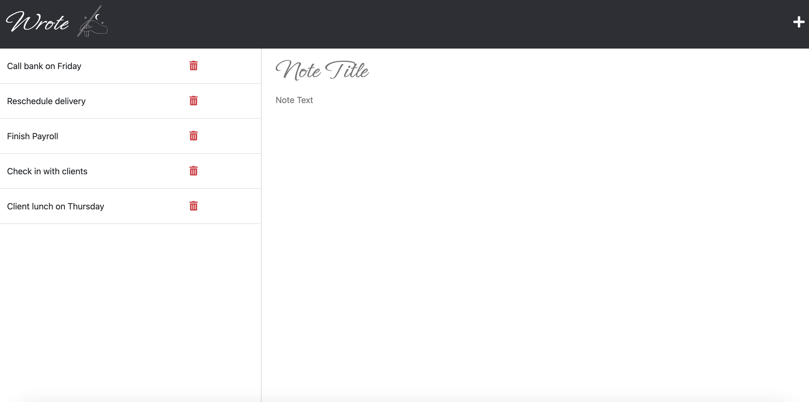
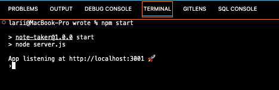

<h1 align="center"> Wrote </h1>

<p align="center">
    
  <br><br>
  <i> Note Taker
    <br> built using Node.js / Express.js</i>
  <br>
</p>

<p align="center">
  <a href="https://wrote.herokuapp.com/"><strong> wrote.herokuapp.com </strong></a>
  <br>
</p>
<br>

<div align="center">


</div>

---
## Description

Wrote is a back-end application designed to help busy professionals stay organized and productive. It allows users to quickly and easily write notes, store them securely, and access them from any device. With its intuitive design and powerful features, Wrote is the perfect tool to increase your job performance  

## Table of Contents
- [Description](#description)
- [Installation](#installation)
  - [Cloning the Repository](#cloning-the-repository)
  - [Prerequisites](#prerequisites)
  - [Setting Up](#setting-up)
- [Mock-Up](#mock-up)
- [Usage](#usage)
- [Questions](#questions)
- [Contributing](#contributing)
  - [Contributing Guidelines](#contributing-guidelines)
  - [Code of Conduct](#code-of-conduct)
- [Credits](#credits)
  - [Acknowledgements](#acknowledgements)
  - [Links](#links)
- [License](#license)

## Installation

### Cloning the Repository

Click `<> code` - the green button. After clicking, in the local tab, copy the SSH key. Open the terminal in your Macbook or [git bash](https://git-scm.com/downloads), if you have Windows/Linux, and type:

```bash
git clone [paste ssh key]
```

I would recommend downloading [Visual Studio Code](https://code.visualstudio.com/download) to edit the code locally. If you need more information on how to clone a repository, [click here](https://docs.github.com/en/repositories/creating-and-managing-repositories/cloning-a-repository)!

### Prerequisites

This package requires you to have [Node.js](https://nodejs.org/en/download/), npm and [Express.js](https://expressjs.com/) installed on your machine. You can install these by running the code below on your terminal:

For `npm`

```bash
curl -o- https://raw.githubusercontent.com/nvm-sh/nvm/v0.39.3/install.sh | bash
```

For `Node.js`

```bash
npm i node@lts
```

For `Express.js`

```bash
npm i express
```

### Setting Up

You can also open the project in VS Code and make sure you are in the directory of this application and then type the command below on your terminal:

```bash
npm i
```

Once you run this, npm will begin the installation process of all of the current project's dependencies.

## Mock-Up

The following images shows the web application's appearance:




## Usage

Launch the application by entering the command below on your terminal:

```bash
npm start
```




After lauching the application, the user will be able to use it locally, on their localhost page. The home page contains a link to the notes page, which has existing notes listed in the left column, plus empty fields, in the right column, for entering a new note title and note text.

The user will only be able to save the new note if it contains a **title** and **content**, and then the save icon will appear in the navigation in the upper right corner of the page. After the note is saved, the new note will be displayed in the left column with the other existing notes.

If an existing note in the list is clicked, it will appear in the right column, but if the user clicks on the write icon in the navigation at the top of the page, they will again be presented with empty fields for entering a new note.

If you need more guidance on how to use Wrote, click [here](https://drive.google.com/file/d/10y5FeAIMznevCLIBznepEWvfWMIs60k8/view) for the tutorial!

## Questions

For questions and support feel free to contact me via:

<a href="mailto:larigens@gmail.com">📧 Email </a> 

<a href="https://github.com/larigens">🐈‍⬛ GitHub </a>

## Contributing
### Contributing Guidelines

Want to report a bug, contribute some code, request a new feature, or improve the documentation? You can submit an issue and I will gladly welcome you as a contributor, but before submitting an issue, please search the issue tracker, as it may already exist!

### Code of Conduct

Our Code of Conduct follows the same principles as the [Contributor Covenant](https://www.contributor-covenant.org/version/2/1/code_of_conduct/), version 2.1.

## Credits
### Acknowledgements

- [W3 Schools](https://www.w3schools.com)
- [MDN](https://developer.mozilla.org/en-US/)
- [Node.js](https://nodejs.org/en/)
- [NPM](https://www.npmjs.com/)
- [README Lab](https://github.com/larigens/readme-lab)
- [Express.js](https://expressjs.com/en/4x/api.html)
- [UUID](https://www.npmjs.com/package/uuid)

### Links

[](https://larigens.github.io/lari-gui/)
[](https://www.linkedin.com/in/lari-gui/)
[](https://twitter.com/coffeebr_eak)

## License

Please refer to the [LICENSE](https://choosealicense.com/licenses/apache-2.0/) in the repo.
